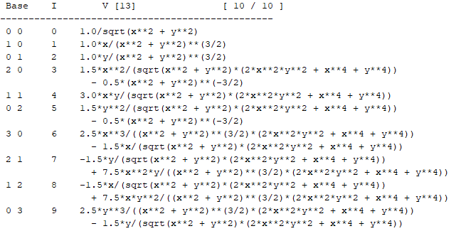
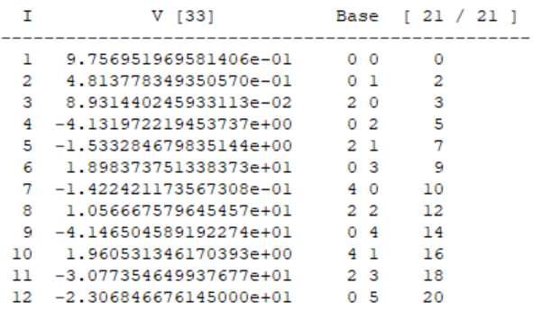
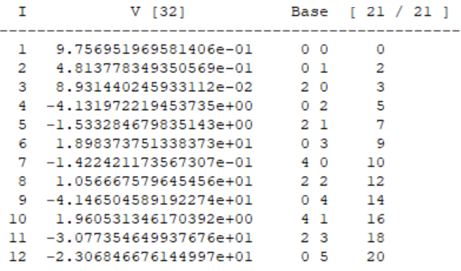

# Summary

The truncated power series algebra (TPSA), or differential algebra (DA), is a well-established and widely used method in particle accelerator physics. It is typically used to generate high-order map of a nonlinear dynamical system but is also used in symplectic tracking, normal form analysis, verified integration, global optimization, fast multipole method, etc.  This package is the first  to carry out symbolic DA-based calculations. Symbolic DA makes it possible to trace the contribution of initial conditions to the final result in a DA calculation process and improve the efficiency of  repeated DA calculations, which potentially broadens the usage of DA. 

# Background

We start with a brief introduction to DA from a practical computational perspective. Please refer to @AIEP108book and @chao2002lecture  for the complete theory.

The fundamental concept in DA is the DA vector. To make this concept easier to understand, we can consider a DA vector as the Taylor expansion of a function at a specific point.  

Considering a function $f(\mathbf{x})$ and its Taylor expansion $f_{\mathrm{T}}(\mathbf{x}_0)$  at the point $\mathbf{x}_0$ up to order $n$, we can define  the equivalence relation between the Taylor expansion and the DA vector as follows

$$ [f]_n = f_{\mathrm{T}}(\mathbf{x}_0) = \sum {C_{n_1,n_2, ..., n_v}} \cdot d_1^{n_1} \cdot \dots \cdot d_v^{n_v}, $$ where $\mathbf{x} = (x_1, x_2, \dots, x_v)$, and $n \ge n_1 + n_2 + \dots + n_v$. Here $d_i$ is a special number: it represents a small variance in $x_i$. To add two DA vectors, we simply add  the coefficients of the like terms. To multiply two DA vectors, we multiply each term in the first one with all the terms in the second one and  then combine like terms while ignoring all terms above order $n$. Given two DA vectors $[a]_n$ and $[b]_n$ and a scalar c, we have

\begin{eqnarray}
[a]_{n}+[b]_{n} & := & [a+b]_{n},\nonumber \\
c\cdot[a]_{n} & := & [c\cdot a]_{n},\label{eq:addmlt}\\
{}[a]_{n}\cdot[b]_{n} & := & [a\cdot b]_{n}.\nonumber 
\end{eqnarray}

According to the fixed point theorem  [@AIEP108book], the inverse of a DA vector that is not infinitely small can be calculated in a finite number of iterations. 

The derivation operator $\partial_v$ with respect to the $v^{\mathrm{th}}$ variable can be defined as 

$$ \partial_v[a]_n = \left[ \frac{\partial}{\partial x_v} a \right]_{n-1}, $$

which can be carried out on a term by term basis on $[a]_n$. The operator $\partial_v$ satisfies the chain rule:

$$ \partial_v([a]\cdot [b]) = [a]\cdot (\partial_v [b]) + (\partial_v [a])\cdot [b]. $$

The inverse operator $\partial^{-1}_v$ can also be defined and applied easily on a term-by-term basis. Once the fundamental operators are defined, the DA vector can be used in calculations just as a number.

The symbolic DA combines DA with symbolic calculation. Any coefficient of a Symbolic DA (SDA) vector is an explicit expression of the symbols in lieu of a number.  

# Statement of need
DA was used in particle beam dynamic analysis in the 1980s and was gradually extended to other fields. DA provides powerful analyzing tools, *i.e.*, map generation,  symplectic tracking [@caprimap], and normal form analysis [@monthnf], for a dynamic system. It is also used in verified integration [@rdaint], global optimization [@makino2005verified], and fast multipole method [@FMMCPO2010].   DA tools are available in several popular programs for particle accelerator design and simulations, *i.e.*,  COSY Infinity [@COSYCAP04], MAD-X [@grote2003mad; @MADX], and PTC [@forest2002introduction]. Stand-alone DA/TPSA libraries include DACE [@massari2018differential; @DACE] and cppTPSA/pyTPSA [@zhang2024cpptpsa]. All of them only perform numerical DA calculation. This library is the first and currently the only one that carries out symbolic DA calculations. 

We developed SDA to improve the efficiency of repetitive DA processes. By performing the computation once with SDA, we obtain an explicit expression for how the final DA vector depends on the initial inputs. Evaluating this expression—rather than rerunning the full DA process for each new input—significantly reduces computation time [@zhang2025Boosting]. SDA also provides an efficient method for computing higher‐order derivatives of any given function.

# Features

This library performs symbolic DA calculations. It is based on the numerical DA library, cppTPSA [@zhang2024cpptpsa]. All the DA calculations are carried out on symbols using exactly the same algorithms in cppTPSA by employing the SymEngine library [@Fernando2024SymEngine]. Users can compile the source code into a static or shared library and install it on their system. The main features of this library are listed as follows. 

1. Define the SDA vector data type.
1. Common math operators are overloaded for SDA vectors.
2. Common mathematical functions are overloaded for SDA vectors. 
3. Support the composition of SDA vectors. 
4. Support derivation and inverse derivation of a SDA vector.
5. Obtain the explicit expression of a partial derivative from a Taylor Expansion, *i.e.*, an SDA vector. 
6. Obtain the callable function on the symbols from an SDA.
7. Obtain the numerical DA from an SDA by assigning values to all the symbols.

The following C++ code shows an example of a simple SDA calculation. This code calculates the SDA vector of $1/\sqrt{x^2+y^2}$ up to the third order.   After initializing a memory pool for 400 SDA vectors and defining the symbols, $x$ and $y$, the SDA vector $f$ is calculated and printed. The value of the SDA vector is shown in \autoref{fig:sda}. The first column shows the orders of the bases, the second column displays the index of each term in the SDA vector, and the last column lists the coefficients of each term. Each coefficient of the SDA vector is an explicit expression in x and y. 

```c++
#include <iostream>
#include <sda.h>
typedef SymbDA::DAVector SDA;
using SymEngine::Expression;

int main() {
    int order{3}, dim{2}, pool{400};
    SymbDA::da_init(order, dim, pool);
    auto& sda = SymbDA::da;
    Expression sx("x"), sy("y");
    SDA f = 1/sqrt((sx+sda[0])*(sx+sda[0]) + (sy+sda[1])*(sy+sda[1]));
    std::cout<<f;
}
```



 

# Verification

This library has been verified with the numerical DA library, cppTPSA, by assigning values to all the symbols in an SDA vector, which results in a numerical DA vector. This vector is then checked against direct calculation using cppTPSA. For example, we calculate an SDA vector $v_1 = \exp(x + d_1^2 + y\cdot d_2)$, in which $x$ and $y$ are symbols and $d_1$, $d_2$ are the bases of the SDA vector. By setting $x=1.5926$ and $y=5.3897$, we obtain the numerical DA vector shown in \autoref{fig:veri_sda} up to the fifth order. It should agree with the numerical DA $v_2 = \exp(1.5926 + d_1^2 + 5.3897\cdot d_2)$, as shown in \autoref{fig:veri_da}. We calculate the relative error for each non-zero coefficient. This procedure is repeated 1,000 times for all the math functions in the SDA lib with randomly generated $x$ and $y$. For the three inverse trigonometric functions, asin, acos, and atan, $x$ ranges in (0, 0.5) and $y$ ranges in (0,1), while for all the other functions, both $x$ and $y$ range in (0,10). In all the cases, the absolute values of the relative errors are less than $1\times 10^{-15}$. 







# Acknowledgements

This material is based upon work supported by the U.S. Department of Energy, Office of Science, Office of Nuclear Physics under contract DE-AC05-06OR23177.


# References

